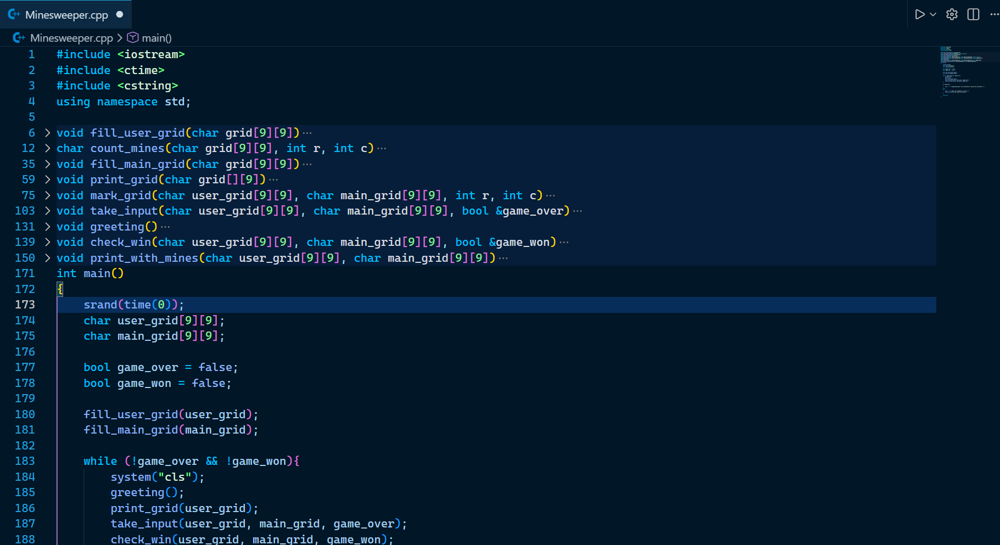
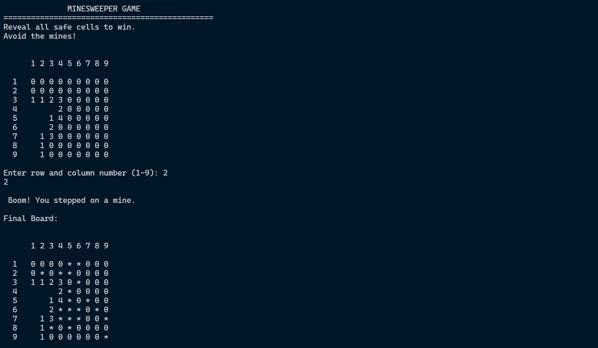

# Minesweeper 🎮

A C++ console-based implementation of the classic Minesweeper game.  
Designed for practicing C++ logic, arrays, and console I/O.

---

## Features
- Generates a random minefield each game
- Allows flagging and uncovering cells
- Detects win/loss conditions automatically
- Console-based interface for quick testing
- Clean, modular code for easy understanding and modification

---

## Function Prototypes
  

---
## Output


---
## How to Run

1. Clone the repository:
   ```bash
   git clone https://github.com/YourUsername/Minesweeper.git

2. Navigate to the project folder:
   ```bash
   cd Minesweeper

3. Compile the code using g++ (example):
   ```bash
   g++ Minesweeper.cpp -o Minesweeper.exe

4. If your project has multiple .cpp files, you can compile them all at once:
   ```bash
   g++ *.cpp -o Minesweeper.exe

5. Run the game:
   ```bash
   ./Minesweeper.exe

6. Enjoy playing! 🎮
